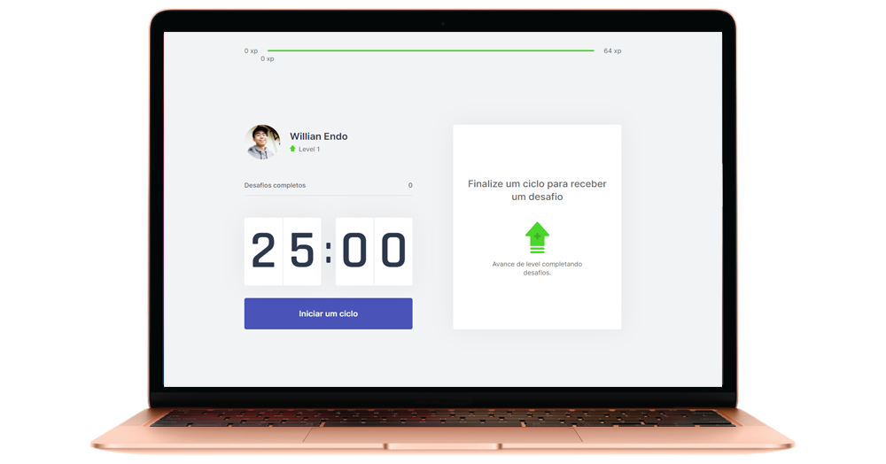

  

  

## 🌐 The Project
- Moveit is an application to help people that works in the computer for long hours. This project uses the Pomodoro Technique, helping people to be helthier while be more produtive. The application basically divides the work into 25 minute periods, after that time it gives you a challenge, it can be a physical exercise or an exercise for the eyes, each challenge gives you xp points and, accumulating the points you level up.

## 🚀 Technologies
- Next.js
- Node.js
- React
- Typescript
- Cookies
 
## 💻 To start web application
- $ cd moveit-next
- $ yarn (to install dependences).
- $ yarn dev (to start the web application).

## 🖥️ Design
<h1 align="center">

  
  
  

  

  
  
  

</h1>
